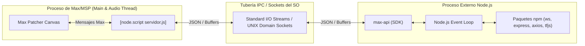

# Módulo 6.2: Node for Max (N4M): Procesamiento Asíncrono e IPC

Mientras que el objeto `[js]` corre dentro del propio proceso e hilos de Max (restringido al Scheduler/Main thread sin acceso a bibliotecas de red externas o npm), **Node for Max (N4M)** implementa un paradigma arquitectónico radicalmente distinto: **la separación de procesos mediante IPC (Inter-Process Communication)**.

A través del objeto `[node.script]`, Max lanza un proceso independiente de **Node.js** en el sistema operativo, abriendo el acceso inmediato a todo el ecosistema de más de dos millones de paquetes de **npm**: servidores HTTP/WebSockets, clientes OSC/MQTT, bases de datos (SQLite, Redis, MongoDB), inferencia de Machine Learning local y web scraping en segundo plano.

---

## 1. Arquitectura de Procesos y Puente IPC

El diseño de N4M resuelve la regla dorada de los sistemas en tiempo real: **el hilo de audio y el planificador temporal jamás deben bloquearse esperando una operación de entrada/salida (I/O) de red o disco**.



### 1.1. Las Dos Vías de la API `max-api`

El paquete oficial `max-api` se inyecta automáticamente cuando el proceso corre bajo Max. Sus funciones esenciales son:

```javascript
const maxAPI = require("max-api");

// 1. Envío de datos desde Node hacia los outlets de Max
maxAPI.outlet("analisis_completado", { pitch: 440, confidencia: 0.98 });
maxAPI.post("Mensaje impreso en la consola Max Console\n");

// 2. Registro de handlers para mensajes provenientes de Max
maxAPI.addHandler("conectar_servidor", (ip, puerto) => {
    maxAPI.post(`Iniciando conexión a ${ip}:${puerto}`);
    // Tarea asíncrona no bloqueante
});

maxAPI.addHandler(maxAPI.MESSAGE_TYPES.BANG, () => {
    maxAPI.outlet("recibi_un_bang");
});
```

---

## 2. Ventajas Arquitectónicas frente a `[js]`

1. **Aislamiento de Cuelgues (Crash Resilience)**: Si tu script de Node.js se queda atrapado en un bucle infinito o arroja una excepción fatal no capturada, **Max no se cuelga ni interrumpe el audio**. Solo el subproceso de Node muere, y Max puede reiniciarlo instantáneamente mediante el mensaje `script start`.
2. **Concurrencia Verdadera y Multi-threading**: Node.js utiliza el bucle de eventos `libuv` con un pool de hilos en C++ para operaciones de disco, criptografía y red, permitiendo cómputo intensivo en segundo plano mientras Max continúa sintetizando audio sin un solo glitch.
3. **Gestión de Paquetes con npm**: El mensaje `script npm install <paquete>` puede ser enviado directamente desde Max para inicializar dependencias.

---

## 3. Laboratorio Práctico: Servidor WebSocket Bi-direccional

En el laboratorio de esta lección creamos un servidor WebSocket local con `ws` en Node.js que:
- Escucha conexiones de navegadores web o dispositivos móviles.
- Recibe datos de sensores de orientación (giroscopio/acelerómetro) en JSON.
- Envía los valores de modulación en tiempo real hacia los sintetizadores de Max/MSP sin latencia perceptible.
