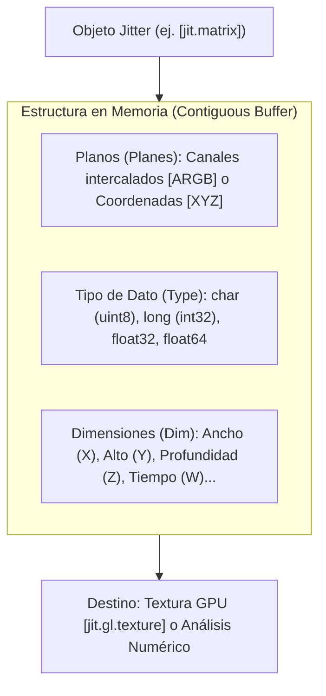

# Apéndice A: Computación Visual y Espacial: Jitter, Matrices y `jit.gen`

Mientras que MSP manipula flujos unidimensionales de audio a frecuencias de muestreo elevadas ($f_s = 48\text{ kHz}$), **Jitter** es la extensión de Max diseñada para el procesamiento multidimensional de datos a velocidades de cuadro (*framerate* de control o video, típicamente de 30 a 120 fps). 

Aunque popularmente se lo asocia con el procesamiento de video, arquitectónicamente Jitter es mucho más que eso: es un **motor genérico de álgebra lineal y matrices $N$-dimensionales** optimizado para gráficos 3D por hardware (OpenGL / Metal / DirectX), geometría computacional, sistemas de partículas y procesamiento de shaders compilados al vuelo mediante `jit.gen` y `jit.gl.slab`.

---

## 1. La Estructura Fundamental: Anatomía de una Matriz Jitter

Toda información en Jitter se representa mediante una matriz definida estrictamente por cuatro atributos inmutables en memoria:

$$\text{Matriz Jitter} = \langle \text{Planos}, \text{Tipo}, \text{Dimensiones} \rangle$$



### 1.1. Planos (*Planes*)
Un plano representa una capa paralela de datos para cada celda de la matriz:
- **1 Plano**: Señales monocromáticas, mapas de altura (*heightmaps*), tablas de probabilidades o valores escalares.
- **3 Planos**: Coordenadas espaciales 3D $(X, Y, Z)$ o color RGB.
- **4 Planos**: Video estándar con canal alfa $(A, R, G, B)$ o cuaterniones de rotación 3D $(W, X, Y, Z)$.

### 1.2. Tipos de Datos (*Types*)
- `char`: Entero sin signo de 8 bits ($0 \dots 255$). Es el estándar de video convencional (bajo consumo de memoria).
- `long`: Entero con signo de 32 bits ($ -2^{31} \dots 2^{31}-1 $).
- `float32`: Punto flotante de precisión simple (IEEE 754). Imprescindible para geometría 3D, cálculos físicos y shaders GLSL.
- `float64`: Precisión doble de 64 bits.

---

## 2. El Pipeline Gráfico Acelerado por GPU (`jit.gl`)

En las versiones modernas de Max, procesar matrices píxel por píxel en la CPU es una práctica obsoleta para gráficos complejos. El ecosistema **`jit.gl`** delega todo el cálculo gráfico a la GPU mediante texturas y buffers de vértices.

```
+-------------------------------------------------------------+
|                     Pipeline de GPU Jitter                  |
|                                                             |
|  [jit.world] (Contexto Maestro, Render Loop a 60 fps)       |
|       |                                                     |
|       +---> [jit.gl.gridshape] (Geometría: Esfera / Toro)   |
|       |          | (Vértices 3D)                            |
|       |          v                                          |
|       +---> [jit.gl.pix] / [jit.gen] (Fragment & Vertex DSP)|
|       |          | (Transformación matricial JIT en GPU)    |
|       |          v                                          |
|       +---> [jit.gl.node] (Sub-escena con cámara / luces)   |
+-------------------------------------------------------------+
```

### 2.1. El Rol Central de `jit.world`
El objeto `[jit.world nombre_contexto]` unifica la ventana de visualización, el contexto de renderizado de hardware y el reloj maestro (*render loop*):
- `@enable 1`: Activa el bucle de renderizado sincronizado con el refresco de pantalla (*V-Sync*).
- `@floating 1`: Ventana siempre flotante sobre el patcher.
- En su outlet emite un `bang` a cada frame para sincronizar animaciones y disparos de control.

---

## 3. Aceleración JIT a Nivel de Vértices y Píxeles: `jit.gen` y `jit.gl.pix`

De forma análoga a cómo `gen~` revoluciona el audio compilando C++ al vuelo, en el dominio visual disponemos de:
- **`jit.gen`**: Compila algoritmos matemáticos en C/C++ optimizados para CPU vectorial (usando SIMD/AVX2) para operar sobre matrices multidimensionales arbitrarias.
- **`jit.gl.pix`**: Compila código **GLSL (OpenGL Shading Language)** directamente a la GPU para ejecutarse en paralelo masivo sobre millones de fragmentos/píxeles por segundo.

### 3.1. Operadores Esenciales en `jit.gen`
- `norm`: Coordenadas normalizadas $(0.0 \dots 1.0)$ a lo largo de las dimensiones de la matriz.
- `snorm`: Coordenadas simétricas normalizadas $(-1.0 \dots +1.0)$, ideales para centrar esferas o deformar mallas tridimensionales.
- `cell`: Coordenadas enteras exactas de la celda procesada.
- `dim`: Dimensiones totales de la matriz.

---

## 4. Sonificación y Visualización Audiovisual Reactiva

Uno de los puntos más altos de Max es la interacción bidireccional entre sonido y visuales. Sin embargo, no todos los métodos de enlace entre MSP y Jitter son equivalentes: la elección de la arquitectura determina si el sistema funcionará suavemente a 60 FPS o si colapsará por caídas de cuadros y colisiones de reloj (*thread locking*).

### 4.1. Paradigma 1: Captura en el Hilo de Control (`[jit.catch~]` y `[peakamp~]`)

El enfoque tradicional consiste en muestrear la señal de audio periódicamente desde el hilo de control o de renderizado:
- **`[peakamp~ intervalo]`**: Calcula el valor de pico en una ventana de milisegundos y emite un número flotante hacia la GPU para modular parámetros geométricos (como escala `scale $1 $1 $1` o rotación). Es liviano y robusto para animación reactiva básica, pero descarta toda la información de fase y distribución armónica.
- **`[jit.catch~ @mode 2]`**: Captura un búfer de muestras de audio en el dominio del tiempo y lo empaqueta en una matriz Jitter 1D cada vez que recibe un `bang` del reloj de video.

> [!WARNING]
> **El Cuello de Botella del Hilo de Eventos**: Si la tasa de refresco del render loop de Jitter oscila o el hilo gráfico sufre una sobrecarga temporal, la captura por sondeo (*polling*) puede desfasarse respecto al flujo continuo de audio, introduciendo aliasing temporal y fluctuaciones visuales (*jitter*).

---

### 4.2. Paradigma 2: El Puente Canónico Audio-GPU con `[pfft~]` y `[jit.poke~]`

Para análisis espectral en tiempo real con máxima precisión matemática, el estándar profesional de la industria consiste en procesar la señal en el dominio de la frecuencia dentro de un subpatcher **`[pfft~]`** y escribir las magnitudes de los *bins* de Fourier directamente en la memoria de una matriz Jitter utilizando **`[jit.poke~]`**.

```text
[ audio in ] ---> [ pfft~ FreqAnalysis.pfft 512 2 ]
                        │
                  [ fftin~ 1 ]
                   ├── Re  ──> [ cartopol~ ] ──> Magnitud (r) ──> [ jit.poke~ analysis 2 0 ]
                   ├── Im  ──> [ cartopol~ ]                           ▲            ▲
                   └── Bin Index (0..255) ─────────────────────────────┘            │
                                                                           [ sig~ 0 ]
```

#### Mecánica Interna del Subpatcher `FreqAnalysis.pfft`:
1. **Descomposición Cartesiana a Polar**:
   El objeto `[fftin~ 1]` entrega la parte real ($	ext{Re}$) en su salida 1, la parte imaginaria ($	ext{Im}$) en su salida 2, y el **índice entero del bin espectral** en su salida 3 como señal de audio sincronizada. El objeto `[cartopol~]` calcula instantáneamente la amplitud o magnitud euclídea:
   $$r = sqrt{	ext{Re}^2 + 	ext{Im}^2}$$
2. **Escritura Directa en Memoria de Matriz (`[jit.poke~]`)**:
   En lugar de esperar un evento de control, `[jit.poke~ analysis 2 0]` escribe la magnitud calculada directamente en la celda correspondiente de la matriz flotante `[jit.matrix analysis 1 float32 1 1]` a velocidad de audio ($f_s$), indexada por la coordenada del bin ($Y = 	ext{bin index}$, $X = 0$).
3. **Dimensionamiento Dinámico con `[fftinfo~]`**:
   El objeto `[fftinfo~]` entrega el número exacto de bins espectrales útiles ($N/2$). Enviando el mensaje `dim 1 $1` a `[jit.matrix analysis]`, la matriz adapta su resolución al tamaño FFT sin desperdicio de memoria.

---

### 4.3. Deformación de Mallas 3D y Renderizado OpenGL (`[jit.gl.mesh]`) a 60 FPS

Una vez que la matriz espectral contiene las amplitudes por frecuencia, la GPU toma el control absoluto:

```text
[ bang (jit.world) ] ──> [ pfft~ (emite matriz) ]
                               │
                       [ jit.dimmap @invert 0 1 ]
                               │
                       [ jit.gen (mapeo X,Y,Z) ]
                               │
             [ jit.gl.mesh ctx @draw_mode line_strip ]
```

1. **Sincronización con el Render Loop**: El reloj maestro de `[jit.world]` dispara un `bang` por cada cuadro visual, solicitando la matriz resultante de `[pfft~]`.
2. **Transformación Geométrica en `[jit.gen]`**: Mediante operadores vectoriales (`snorm`, `swiz`, `vec`), la GPU asigna el índice de frecuencia al eje horizontal ($X$) y la magnitud calculada al desplazamiento vertical ($Y$):
   $$ec{P} = langle 	ext{snorm.y},; r cdot k,; 0.0 
angle$$
3. **Malla Acelerada por Hardware (`[jit.gl.mesh]`)**: Configurado con `@draw_mode line_strip` o `@draw_mode tri_grid`, el objeto dibuja la cinta espectral directamente en el búfer de vértices de la tarjeta de video, logrando un visualizador espectral 3D de alta fidelidad sin penalizar el hilo de audio ni el hilo de interfaz.

---

## 5. Laboratorio Práctico: Visualizador Reactivo Dual (Toroide + Malla Espectral 3D)

En los archivos complementarios:
- [`book/patches/apendices/lab_apendice_a_jitter.maxpat`](/patches/apendices/lab_apendice_a_jitter.maxpat)
- [`book/patches/apendices/FreqAnalysis.pfft.maxpat`](/patches/apendices/FreqAnalysis.pfft.maxpat)

Construimos un entorno visual y acústico completo que compara ambos paradigmas frente a frente:
- **Módulo de Audio**: Un oscilador sinusoidal (`cycle~ 220`) sumado a una onda sierra (`saw~ 330`) genera un espectro rico con fundamental y múltiples armónicos.
- **Rama 1 (Control-Rate)**: `peakamp~ 20` modula la escala y rotación de un toroide 3D (`jit.gl.gridshape @shape torus`).
- **Rama 2 (Signal-to-GPU)**: El subpatcher `[pfft~ FreqAnalysis.pfft 512 2]` escribe las amplitudes de los 256 bins en una matriz flotante, procesada por `jit.gen` para deformar una cinta tridimensional en tiempo real con `[jit.gl.mesh @draw_mode line_strip @color 0.2 0.8 1. 1.]` a 60 cuadros por segundo.

