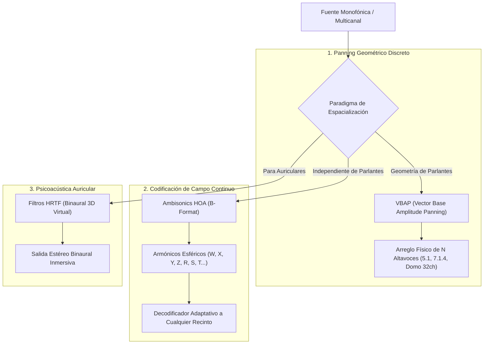

# Apéndice F: Espacialización Sonora y Audio Inmersivo 3D (`IRCAM Spat5` y `Ambisonics`)

El sonido en el mundo físico no es un fenómeno estéreo ni una línea que sale de dos monitores de estudio: es un campo de presión acústica tridimensional continuo que interactúa con la geometría del espacio, los materiales y la fisionomía de nuestra cabeza y pabellón auditivo.

En la música electroacústica, los conciertos multicanal, el diseño sonoro de videojuegos y la realidad virtual, **Max/MSP es el estándar de facto a nivel mundial para el procesamiento y espacialización de audio 3D**. En este apéndice abordamos los dos paradigmas matemáticos y acústicos fundamentales: **IRCAM Spat5** y **Ambisonics de Orden Superior (HOA)**.

---

## 1. Los Paradigmas de Espacialización 3D

### 1.1. VBAP (Vector Base Amplitude Panning - Ville Pulkki)
- Divide el espacio tridimensional de parlantes en triángulos (o pares en 2D).
- Calcula la ganancia de cada altavoz como una combinación lineal de vectores de base en coordenadas cartesianas. Si la fuente virtual coincide con un parlante, solo ese parlante suena; si se mueve entre ellos, la energía se reparte preservando la potencia acústica total.

### 1.2. Ambisonics de Orden Superior (HOA - Gerzon / Daniel)
- **Desacoplamiento Total**: En lugar de mezclar para un número fijo de parlantes, se codifica la direccionalidad de la onda en una serie de **armónicos esféricos** (Orden 1 = 4 canales $B\text{-Format}$: $W, X, Y, Z$; Orden 3 = 16 canales; Orden 5 = 36 canales).
- Una vez codificado el master en Ambisonics, podés reproducirlo en auriculares con decodificación binaural, en un cine 7.1.4 o en un auditorio con 64 parlantes simplemente cambiando la matriz de decodificación (`ambidecode~` o `spat5.hoa.decoder~`).

---

## 2. La Suite IRCAM Spat5: Acústica y Percepción

El paquete **Spat5** (desarrollado por el equipo de Representaciones Musicales del IRCAM) no solo posiciona el sonido en el espacio, sino que modela la **acústica perceptiva de recintos**:

1. **Sonido Directo (*Direct Sound*)**: Retardo temporal por distancia ($\Delta t = d / c$) y atenuación por ley del cuadrado inverso de la distancia ($1/d^2$).
2. **Reflexiones Tempranas (*Early Reflections*)**: Ecos discretos generados por las paredes que informan al cerebro sobre el tamaño aparente de la habitación.
3. **Reverberación Tardía (*Late Reverberation*)**: Redes de retardo con retroalimentación (FDN - *Feedback Delay Networks*) densas, homogéneas y libres de coloración tímbrica.
4. **Control Perceptivo**: En lugar de ajustar coeficientes biquad abstractos, Spat5 te permite automatizar atributos psicoacústicos: *Source Presence* (presencia de la fuente), *Warmth* (calidez acústica), *Envelopment* (envolvimiento del oyente) y *Room Size* (volumen del espacio).

---

## 3. Laboratorio Práctico: Panner Circular 3D con Simulación de Distancia y Headroom

En el parche interactivo `lab_apendice_f_audio_espacial.maxpat`:
- Implementamos una fuente sonora en órbita tridimensional circular continua.
- Calculamos el retardo temporal variable de propagación del aire con `delay~`.
- Modulamos la atenuación de alta frecuencia dependiente de la distancia del aire mediante un filtro pasa-bajos dinámico.
- Distribuimos la energía sonora a un sistema de 4 cuadrantes (cuadrafónico simulado) con atenuación de headroom nominal de -12 dB.
