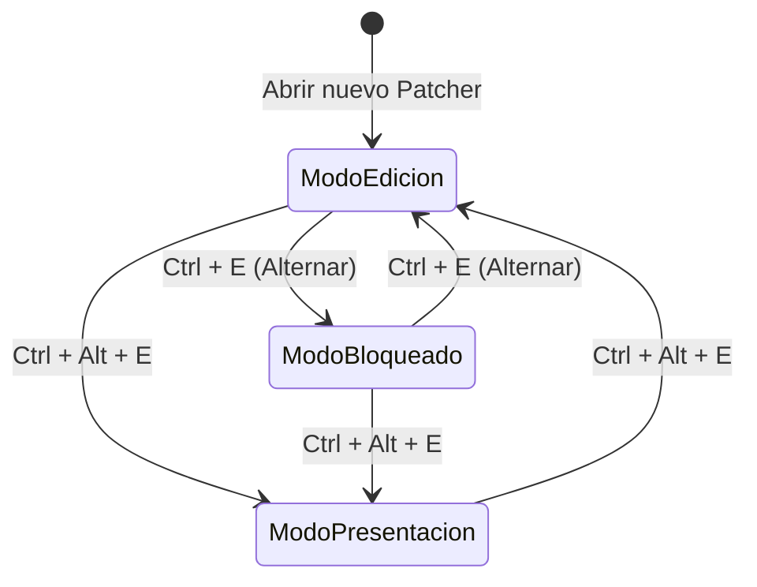

---
title: "01. Anatomía de la Interfaz y Modos de Operación"
description: "Fundamentos del entorno de desarrollo visual en Max/MSP: modos de ejecución, presentación, inspector y atajos esenciales."
---

El entorno de desarrollo interactivo de Max/MSP está fundamentado en un lienzo gráfico (*patcher canvas*) diseñado para prototipar, programar y ejecutar algoritmos en tiempo real. Antes de estudiar el flujo de datos o la matemática de señales, es indispensable dominar las dinámicas operativas de su interfaz de usuario.

---

## 1. Los Tres Modos de Operación del Lienzo

La interacción con cualquier documento en Max oscila entre tres estados fundamentales:



### 1.1. Modo Edición (*Unlocked Mode*)
* **Atajo de conmutación:** `Ctrl + E` (Windows) / `Cmd + E` (macOS).
* **Indicador visual:** El icono de candado en la esquina inferior izquierda de la ventana permanece **abierto**; el cursor del ratón adopta la forma de flecha estándar o cruz de selección.
* **Comportamiento:**
  * Permite crear, mover, redimensionar y eliminar objetos.
  * Habilita el trazado de cables (*patchcords*) entre puertos de entrada (*inlets*) y salida (*outlets*).
  * No responde a la manipulación interactiva de sliders, botones o cajas de número mediante arrastre estándar (al hacer clic sobre un objeto, este se selecciona para edición).

### 1.2. Modo Bloqueado o Ejecución (*Locked Mode*)
* **Atajo de conmutación:** `Ctrl + E`.
* **Indicador visual:** El icono de candado inferior se encuentra **cerrado**.
* **Comportamiento:**
  * La topología gráfica queda fija e inmutable (no es posible mover cajas ni desconectar cables por accidente).
  * Los controles interactivos cobran vida: los botones disparan eventos (*bang*), los conmutadores (*toggles*) alternan entre 0 y 1, y los sliders o campos numéricos modifican su valor al arrastrar el ratón.
  * **Técnica de Bloqueo Temporal (*Temporary Lock*):** Estando en Modo Edición, es posible interactuar momentáneamente con un objeto sin cambiar de modo manteniendo presionada la tecla `Ctrl` (Windows) o `Cmd` (macOS) y haciendo clic sobre el control.

### 1.3. Modo Presentación (*Presentation Mode*)
* **Atajo de conmutación:** `Ctrl + Alt + E`.
* **Inclusión de objetos:** `Ctrl + Alt + P` (*Add to Presentation* / *Remove from Presentation*).
* **Propósito:** Separar la lógica computacional del diseño de usuario. Permite construir una interfaz gráfica limpia (GUI) exhibiendo únicamente faders, medidores y perillas, mientras que la compleja red de cables, operaciones lógicas y objetos auxiliares permanece oculta en el fondo.

```
┌────────────────────────────────────────────────────────────────────────┐
│                        ARQUITECTURA DE VISTAS                          │
├──────────────────────────────────┬─────────────────────────────────────┤
│      VISTA DE PARCHEO (PATCHING) │      VISTA DE PRESENTACIÓN (GUI)    │
│  (Ctrl + E: Lógica completa)     │  (Ctrl + Alt + E: Interfaz limpia)  │
├──────────────────────────────────┼─────────────────────────────────────┤
│  [r freq]                        │                                     │
│     │                            │     ┌─────────┐   ┌─────────┐       │
│  [*~ 2.5]  [mtof]   [cycle~]     │     │ FREQ    │   │ VOLUMEN │       │
│     │        │         │         │     │ (dial)  │   │ (meter) │       │
│  [lores~ 1200 0.8]     │         │     └─────────┘   └─────────┘       │
│     └───────┬──────────┘         │                                     │
│          [*~ 0.5]                │   (Cables y operadores matemáticos  │
│             │                    │    invisibles para el usuario final)│
│          [ezdac~]                │                                     │
└──────────────────────────────────┴─────────────────────────────────────┘
```

---

## 2. Topología Perimetral de la Ventana

El marco de trabajo de Max organiza sus herramientas en cuatro barras perimetrales que rodean el lienzo central:

```
┌─────────────────────────────────────────────────────────────────────────┐
│ [Top Toolbar]  Objetos rápidos (N, M, C, B, I, F, T) · Zoom · Bloqueo  │
├───────┬─────────────────────────────────────────────────────────┬───────┤
│       │                                                         │       │
│ Left  │                                                         │ Right │
│ Tool  │                     LIENZO CENTRAL                      │ Tool  │
│ bar   │                    (Patcher Canvas)                     │ bar   │
│       │                                                         │       │
│ Files │                                                         │ Insp. │
│ Pkgs  │                                                         │ Help  │
│ Snips │                                                         │ Ref.  │
│       │                                                         │       │
├───────┴─────────────────────────────────────────────────────────┴───────┤
│ [Bottom Toolbar]  Candado · Presentación · DSP Audio On/Off · CPU Meter │
└─────────────────────────────────────────────────────────────────────────┘
```

1. **Barra Superior (*Top Toolbar*):** Acceso rápido para la inserción de objetos canónicos, alineación geométrica, segmentación y opciones de formateo de texto.
2. **Barra Inferior (*Bottom Toolbar*):**
   - Conmutador de bloqueo (*Lock/Unlock*).
   - Selector de Modo Presentación.
   - Conmutador maestro de audio DSP (icono de altavoz) y medidor porcentual de carga de CPU en el hilo de audio (*Audio Thread*).
3. **Barra Lateral Izquierda (*Left Toolbar*):**
   - Explorador de archivos del proyecto.
   - Gestor de fragmentos de código (*Snippets*).
   - Acceso al Package Manager y plugins externos.
4. **Barra Lateral Derecha (*Right Toolbar*):**
   - **El Inspector:** Configuración exhaustiva de propiedades.
   - **Diccionario de Referencia:** Acceso instantáneo a mensajes, argumentos y atributos del objeto seleccionado.
   - Navegador de ayuda oficial (*Max Documentation*).

---

## 3. El Inspector de Objetos (`Ctrl + I`)

Todo objeto instanciado en Max posee una tabla de propiedades internas administrada mediante el **Inspector** (`Ctrl + I` en Windows / `Cmd + I` en macOS).

Al seleccionar un objeto y presionar `Ctrl + I`, se despliega una ventana dividida en categorías funcionales:

| Categoría | Descripción Técnica | Ejemplos de Parámetros |
| :--- | :--- | :--- |
| **Basic** | Parámetros que definen el comportamiento algorítmico y memoria. | Nombres de scripting (`varname`), argumentos iniciales, paso de señal. |
| **Value** | Rango numérico, escala y restricciones de datos. | `Minimum Value`, `Maximum Value`, `Clip Mode`, tipo (`float`/`int`). |
| **Appearance** | Estilizado visual en el lienzo y en presentación. | Color de fondo, color de señal de audio, grosor de línea, visibilidad. |
| **Behavior** | Modos de interacción frente a eventos del ratón o teclado. | `Ignore Click`, `Parameter Mode Enabled` (para presets y M4L). |
| **Presentation** | Posicionamiento relativo exclusivo para la GUI desacoplada. | `Include in Presentation`, coordenadas rectangulares de presentación. |

---

## 4. Atajos de Teclado Universales para Construcción Rápida

En lugar de arrastrar elementos desde los menús con el ratón, el flujo de trabajo estándar en Max se basa en la pulsación de una única tecla al hacer clic en el lienzo (Modo Edición activo):

| Tecla | Objeto Resultante | Descripción Funcional |
| :---: | :--- | :--- |
| `N` | `[object]` | Caja de objeto vacía. Permite escribir el nombre de cualquier clase (`cycle~`, `metro`, `trigger`, etc.). |
| `M` | `[message]` | Caja de mensaje. Almacena texto o números estáticos que se despachan al recibir un estímulo. |
| `C` | `[comment]` | Texto explicativo o documentación en el lienzo (no ejecuta computación). |
| `B` | `[button]` | Botón pulsador (*Bang*). Convierte cualquier evento entrante en un estímulo instantáneo. |
| `I` | `[number]` | Caja de número entero (*Integer*). Visualiza y modula valores numéricos sin decimales. |
| `F` | `[flonum]` | Caja de número en coma flotante (*Float*). Visualiza y modula valores fraccionarios con precisión decimal. |
| `T` | `[toggle]` | Conmutador biestable. Alterna entre `0` (apagado) y `1` (encendido) ante cada bang. |

---

## 5. Higiene Visual y Enrutamiento de Conexiones

En parches de mediana y gran envergadura, la acumulación desordenada de cables compromete la legibilidad y el mantenimiento. Max incorpora herramientas de higiene visual indispensables:

### 5.1. Segmentación y Alineación Automática de Cables (`Ctrl + Y`)
* Seleccionar dos o más objetos conectados y presionar `Ctrl + Y` (Windows) o `Cmd + Y` (macOS).
* Max redibuja los cables con ángulos rectos de $90^\circ$ estructurados, eliminando diagonales que crucen otras cajas.

### 5.2. Alineación de Objetos
* **Alinear Horizontalmente:** Seleccionar las cajas y presionar `Ctrl + Shift + H`.
* **Alinear Verticalmente:** Seleccionar las cajas y presionar `Ctrl + Shift + V`.

### 5.3. Cables Rectilíneos vs. Curvos
En el menú **Options**  **Preferences**  **Patcher Windows**, es posible seleccionar el estilo de cable predeterminado (*Patchcord Style*):
* **Segmented:** Conexiones con esquinas ortogonales estables.
* **Curved:** Conexiones mediante splines Bezier continuas.

---

## 6. Resumen de Operaciones Esenciales

```
ACCIONES CLAVE EN EL LIENZO:
1. Alternar Edición / Bloqueado   -> Ctrl + E
2. Bloqueo temporal interactivo   -> Mantener Ctrl + Clic en objeto
3. Abrir Inspector de Propiedades -> Ctrl + I
4. Modo Presentación              -> Ctrl + Alt + E
5. Añadir a Presentación          -> Ctrl + Alt + P
6. Segmentar cables enredados     -> Ctrl + Y
7. Crear Objeto / Mensaje         -> N / M
```
