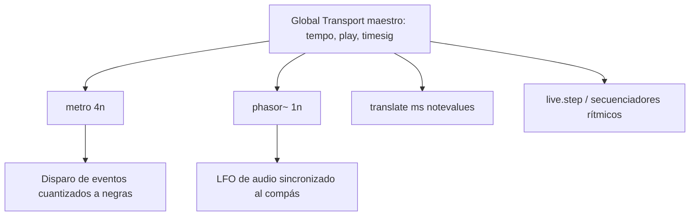

---
title: "03. Transporte Global, Mapeos y Asignaciones"
description: "Sincronización métrica maestro con el Global Transport [transport], unidades de tiempo musical y mapeo físico directo con MIDI Mapping y Key Mapping."
---

En la creación de sistemas musicales, generativos o performáticos interactivos, dos requerimientos arquitectónicos resultan fundamentales:
1. **Un reloj métrico unificado:** Capaz de coordinar secuenciadores, envolventes y LFOs bajo subdivisiones rítmicas canónicas (negras, tresillos, compases) y tempo en BPM, en lugar de milisegundos crudos.
2. **Control físico desacoplado:** Capacidad de enlazar perillas, faders y teclas de controladores externos o del teclado del ordenador a cualquier elemento gráfico de la interfaz sin trazar cables engorrosos por todo el lienzo.

---

## 1. El Transporte Global (*Global Transport*)

Max incorpora un motor de sincronización de tiempo musical denominado **Global Transport**. Este reloj centraliza el estado de reproducción (`play`/`stop`), el tempo métrico en BPM, la signatura de compás (*time signature*) y la resolución temporal en ticks (480 PPQ: *Pulses Per Quarter Note*).



### 1.1. El Objeto `[transport]`
El objeto `[transport]` permite consultar y manipular programáticamente el estado del reloj maestro:

```
          [toggle]             [flonum: 120.]
             │                       │
         [metro 20]             [tempo $1]
             │                       │
             └────────► [transport] ◄┘
                             │
            ┌────────────────┼────────────────┐
            ▼                ▼                ▼
     (1: compás.negra.tick) (2: BPM)  (3: timesig num/den)
```

* **Mensaje `1` / `0`:** Arranca o detiene el reloj global.
* **Mensaje `tempo <bpm>`:** Modifica la velocidad rítmica en pulsos por minuto (ej. `tempo 135.5`).
* **Mensaje `timesig <num> <den>`:** Define el compás musical (ej. `timesig 3 4` o `timesig 7 8`).
* **Mensaje `rewind`:** Reinicia la cuenta del transporte al compás $1$, tiempo $1$, tick $0$.

### 1.2. Valores de Tiempo Métrico Musical (*Time Values*)
En lugar de fijar intervalos en milisegundos fijos (que se desfasan si el tempo cambia), Max permite alimentar generadores temporales utilizando cadenas de notación métrica relativa:

| Notación de Tiempo | Significado Musical | Equivalente a 120 BPM |
| :--- | :--- | :--- |
| `1nd` | Redonda con puntillo | 3000 ms |
| `1n` | Redonda (compás de 4/4 completo) | 2000 ms |
| `2n` | Blanca | 1000 ms |
| `4n` | Negra (un pulso estándar) | 500 ms |
| `4nt` | Tresillo de negra | 333.33 ms |
| `8n` | Corchea | 250 ms |
| `8nd` | Corchea con puntillo | 375 ms |
| `16n` | Semicorchea | 125 ms |
| `32n` | Fusa | 62.5 ms |

### 1.3. Sincronización en Objetos Clave
* **Temporizadores de Control:** `[metro 4n @active 1]` dispara eventos rítmicos exactamente en cada negra, acelerando o desacelerando en sincronía absoluta ante cualquier variación del transporte global.
* **Osciladores y Moduladores de Audio:** `[phasor~ 2n]` genera una rampa de señal sincronizada cuya frecuencia se recalcula continuamente para completar un ciclo exacto en la duración de una blanca.
* **Traducción y Conversión Temporal:** El objeto `[translate ms notevalues]` o `[translate notevalues ticks]` convierte de manera bidireccional entre milisegundos, divisiones de compás, frecuencias en Hertz y ticks relativos.

---

## 2. Funciones de Asignación y Mapeo (*Mapping & Assign*)

Para controlar instrumentos interactivos en vivo, Max provee dos mecanismos de enlace directo sin cables visuales: **MIDI Mapping** y **Key Mapping**.

```
┌────────────────────────────────────────────────────────────────────────┐
│                        ARQUITECTURA DE MAPEOS                          │
├──────────────────────────────────┬─────────────────────────────────────┤
│          MIDI MAPPING            │             KEY MAPPING             │
│   (Controlador físico externo)   │     (Teclado de la computadora)     │
├──────────────────────────────────┼─────────────────────────────────────┤
│   Fader / Potenciómetro Físico   │         Tecla 'Barra Espaciadora'   │
│              │                   │                    │                │
│              ▼                   │                    ▼                │
│        [ MIDI LEARN ]            │             [ KEY LEARN ]           │
│              │                   │                    │                │
│              ▼                   │                    ▼                │
│     Dial gráfico [live.dial]     │         Botón [button] / [toggle]   │
│   (Escalado: Min: 20, Max: 20000)│         (Disparo instantáneo)       │
└──────────────────────────────────┴─────────────────────────────────────┘
```

### 2.1. Modo de Mapeo MIDI (*MIDI Map Mode*)
* **Propósito:** Asignar mensajes de Control Change (CC), ruedas de modulación, faders motorizados o notas de sintetizadores externos a cualquier control del parche.
* **Flujo Operativo:**
  1. En la barra de herramientas inferior de la ventana, hacer clic en el icono **MIDI** (o seleccionar **Tools**  **MIDI Map Mode**).
  2. La interfaz adoptará un resaltado visual de color **azul**.
  3. Hacer clic sobre el objeto gráfico que se desea controlar (por ejemplo, un dial o slider).
  4. Mover físicamente el potenciómetro o pulsar el botón en el controlador MIDI externo. Max detectará el número de canal y CC automáticamente (*MIDI Learn*).
  5. Desactivar el modo MIDI Map haciendo clic nuevamente en el icono de la barra inferior.

### 2.2. Modo de Mapeo de Teclado (*Key Map Mode*)
* **Propósito:** Asignar teclas del teclado QWERTY del ordenador para disparar acciones inmediatas (ej. barra espaciadora para reproducir/detener, teclas numéricas para conmutar presets o filtros).
* **Flujo Operativo:**
  1. Hacer clic en el icono **KEY** de la barra de herramientas inferior (o **Tools**  **Key Map Mode**).
  2. La interfaz se teñirá de color **naranja**.
  3. Seleccionar el objeto de destino en el lienzo.
  4. Presionar la tecla física elegida en el teclado del ordenador.
  5. Desactivar el modo de mapeo haciendo clic en el icono **KEY**.

---

## 3. Configuración de Rangos y Parámetros en el Inspector

Al mapear un controlador físico (cuyo rango MIDI estándar suele estar cuantizado en 7 bits, de $0$ a $127$), surge el desafío de traducirlo a variables del mundo real (por ejemplo, frecuencias audibles de $20\text{ Hz}$ a $20.000\text{ Hz}$ o ganancias en decibelios de $-70\text{ dB}$ a $+6\text{ dB}$).

Para optimizar este comportamiento:
1. Emplear objetos de la familia **Live UI** (`[live.dial]`, `[live.slider]`, `[live.numbox]`).
2. Abrir el **Inspector** (`Ctrl + I`) del control.
3. Configurar los atributos de rango:
   * **Type:** Float o Int.
   * **Range / Minimum - Maximum:** Establecer los valores inferior y superior reales.
   * **Unit Style:** Seleccionar unidades automáticas (`Hz`, `dB`, `ms`, `%`, `Semitones`).
   * **Curve / Power:** Modificar la respuesta de lineal a exponencial/logarítmica para que el giro del potenciómetro físico coincida con la percepción auditiva humana.
