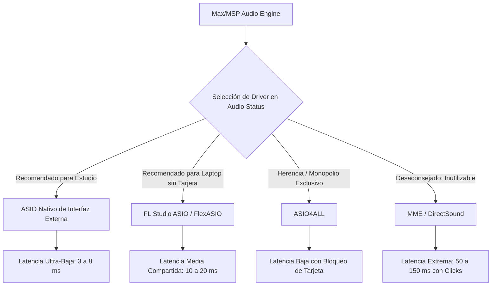

---
title: "04. Consola de Max, Diagnóstico y Configuración de Audio"
description: "Diagnóstico en tiempo real mediante la Max Console [print], niveles de logging y configuración técnica de controladores de audio ASIO en Windows."
---

La programación de sistemas interactivos y de procesamiento de señales en tiempo real requiere dos pilares técnicos antes de ejecutar cualquier algoritmo sonoro:
1. **Un canal de telemetría y diagnóstico robusto:** Para inspeccionar variables, detectar excepciones lógicas y verificar tipos de datos en ejecución sin sobrecargar la interfaz gráfica.
2. **Una configuración rigurosa del subsistema de audio en el sistema operativo:** Para garantizar que el hilo de cálculo de señal (*Audio Thread*) opere con latencia mínima y sin riesgo de interrupciones (*clicks* o *dropouts*).

---

## 1. La Consola de Max (*Max Console*)

La **Max Console** es la ventana maestra de registro de eventos (*logging*) y depuración del sistema.

* **Atajo de apertura:** `Ctrl + M` (Windows) / `Cmd + M` (macOS).
* **Acceso alternativo:** Menú **Window**  **Max Console**, o haciendo clic en el icono de ventana de terminal en la barra lateral derecha.

```
┌────────────────────────────────────────────────────────────────────────┐
│                              MAX CONSOLE                               │
├─────────┬──────────────────────────────────────────────────────────────┤
│ TIPO    │ MENSAJE REGISTRADO                                           │
├─────────┼──────────────────────────────────────────────────────────────┤
│ Info    │ print frecuencia: 440.000000                                 │
│ Warning │ live.dial: minimum value must be less than maximum value     │
│ Error   │ dsp: unable to allocate memory for delay line buffer         │
│ Clang/C │ my_external: initialized perform64 routine with SIMD AVX2    │
└─────────┴──────────────────────────────────────────────────────────────┘
```

### 1.1. Niveles de Notificación
1. **Mensajes Informativos (*Info*):** Salidas voluntarias despachadas mediante el objeto `[print]` o funciones de diagnóstico.
2. **Advertencias (*Warnings*):** Mensajes en color amarillo. Notifican inconsistencias no fatales (por ejemplo, argumentos omitidos que asumieron valores predeterminados o rangos invertidos en objetos gráficos).
3. **Errores Críticos (*Errors*):** Mensajes en color rojo. Indican excepciones de ejecución, punteros nulos, ciclos de retroalimentación en $t=0$ (*Stack Overflow*) o intentos de cargar abstracciones inexistentes (*"no such object"*).

### 1.2. Impresión de Datos en Tiempo Real: El Objeto `[print]`
Para inspeccionar el contenido de cualquier cable de control:
* Instanciar un objeto `[print identificador]`:
  ```
  [ + 15 ]
     │
  [print resultado_suma]
  ```
* En la consola se registrará la etiqueta `resultado_suma:` acompañada del valor exacto recibido.
* **En desarrollo bajo nivel (C SDK):** La función equivalente es `post("Valor: %f\n", x->mi_variable);`.

### 1.3. Herramientas de Filtrado y Depuración
* **Buscador de texto:** Permite aislar mensajes introduciendo el nombre de un objeto o variable específica.
* **Filtro por Severidad:** Botones para exhibir exclusivamente errores críticos, advertencias o mensajes informativos.
* **Limpiar Consola (*Clear*):** Botón de papelera o comando para restablecer el historial y evaluar nuevas pruebas desde un estado en blanco.

---

## 2. Configuración del Subsistema de Audio en Windows

A diferencia de macOS (donde la API unificada CoreAudio gestiona el enrutamiento con latencias bajas predeterminadas), en el entorno Windows la arquitectura de controladores requiere una selección cuidadosa:



### 2.1. Comparativa de Controladores en Windows

| Controlador | Latencia Promedio | Estabilidad | Recomendación de Uso |
| :--- | :--- | :--- | :--- |
| **ASIO Dedicado del Fabricante** (Focusrite, MOTU, RME, Universal Audio) | $3\text{ a }8\text{ ms}$ | Óptima | **La opción profesional indiscutible.** Conexión directa con los registros del hardware sin pasar por el mezclador de Windows. |
| **FL Studio ASIO** | $10\text{ a }20\text{ ms}$ | Muy Buena | **La mejor opción para trabajo móvil sin interfaz externa.** Permite audio compartido (usar Max y reproducir simultáneamente un video en YouTube o audio en Spotify). |
| **FlexASIO** | $8\text{ a }15\text{ ms}$ | Buena | Controlador ASIO de código abierto basado en la API WASAPI de Windows. |
| **ASIO4ALL** | $5\text{ a }12\text{ ms}$ | Regular | Emula ASIO sobre WDM. Tiende a tomar control exclusivo de la tarjeta de sonido, silenciando el resto de las aplicaciones del sistema. |
| **MME / DirectSound** | $50\text{ a }150\text{ ms}$ | Inaceptable | Capas heredadas de Windows. Provocan latencias incompatibles con síntesis interactiva. |

---

## 3. Parámetros Críticos en la Ventana *Audio Status* (`Ctrl + Shift + A`)

Para configurar el motor de audio en Max:
1. Ir al menú **Options**  **Audio Status...** (atajo `Ctrl + Shift + A` en Windows).
2. Verificar los siguientes parámetros de ingeniería:

```
┌────────────────────────────────────────────────────────┐
│                   AUDIO STATUS (MAX)                   │
├────────────────────────────────────────────────────────┤
│  Driver:               [ ASIO ]                        │
│  Device:               [ Tu Driver ASIO / FL ASIO ]    │
│  Input Device:         [ Canal de Entrada ]            │
│  Output Device:        [ Canales de Salida Físicos ]   │
│  Sampling Rate:        48000 Hz (o 44100 Hz)           │
│  I/O Vector Size:      256 o 512                       │
│  Signal Vector Size:   64                              │
│  Scheduler in Overdrive:  [X] Activado                 │
│  Audio Interrupt:         [X] Activado                 │
└────────────────────────────────────────────────────────┘
```

### Explicación de los Parámetros:
* **Sampling Rate (Frecuencia de Muestreo):** Fijar en $48.000\text{ Hz}$ (estándar profesional de la industria audiovisual) o $44.100\text{ Hz}$ (estándar CD).
* **I/O Vector Size (Búfer del Hardware):**
  * `256 muestras`: Equilibrio óptimo entre respuesta táctil inmediata y consumo moderado de CPU.
  * `512 muestras`: Recomendado para computadoras portátiles modestas o sesiones de síntesis polifónica con alta carga de procesamiento.
* **Signal Vector Size (Búfer Interno de MSP):** Debe mantenerse rigurosamente en **`64 muestras`**. En Max, la computación vectorial en C está optimizada para procesar bloques de 64 muestras (alineadas con múltiplos del I/O Vector: 128, 256, 512).
* **Scheduler in Overdrive:** Debe permanecer **siempre activado**. Garantiza que el reloj de eventos de Max se ejecute en un hilo de tiempo real con alta prioridad, evitando que operaciones gráficas pesadas desincronicen el tempo musical.
* **Audio Interrupt:** Conmutar a activo para que los mensajes de control con precisión de tiempo se resuelvan en sincronía con el procesamiento del vector de audio.

---

## 4. Verificación Funcional del Motor de Audio

Para comprobar la operatividad del sistema de audio:
1. En la ventana **Audio Status**, activar el interruptor **Audio: On** (o pulsar el altavoz en la barra inferior del parche).
2. Crear un parche con los siguientes objetos elementales:
   ```
   [cycle~ 440]
      │
   [*~ 0.2]  <-- Factor de atenuación para evitar saturación
      │   └──┐
   [ezdac~]  <-- Convertidor Digital a Analógico estéreo
   ```
3. Al encender el objeto `[ezdac~]`, el sistema debe emitir un tono sinusoidal puro a $440\text{ Hz}$ sin chasquidos, interrupciones ni retrasos perceptibles.
