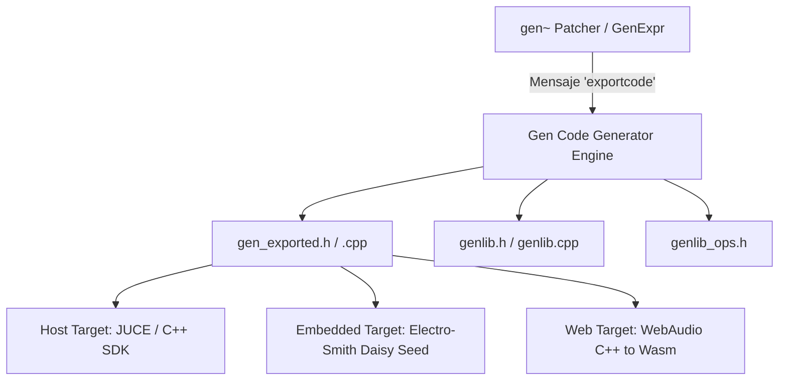

Uno de los pilares arquitectónicos más revolucionarios de `gen~` dentro del ecosistema Cycling '74 es su capacidad de desacoplamiento total del host. Cuando diseñamos un algoritmo en `gen~`, no estamos simplemente atados a Max/MSP: estamos utilizando un meta-compilador de procesamiento de señal en tiempo real capaz de traducir su árbol de sintaxis abstracta (AST) a **código fuente C++ estándar ISO (C++11/C++14)** portable, libre de dependencias propietarias de Max, estructurado como una clase de bajo nivel orientada a computación muestra a muestra (`perform()`).

Este paradigma habilita el flujo moderno de ingeniería de audio: **prototipado interactivo ultrarrápido en Max y despliegue a producción en microcontroladores (Daisy, Teensy), plugins nativos (JUCE, VST3, AU) y DSP web (WebAssembly / AudioWorklet)**.

---

## 1. Arquitectura de `exportcode`: Anatomía del C++ Generado

Al enviar el mensaje `exportcode` a un objeto `gen~` (o configurarlo en la ventana de inspector del patcher `gen~`), el compilador interno genera una carpeta con una estructura estandarizada de archivos C++.



### 1.1. Los Archivos Fundamentales

1. **`gen_exported.h` y `gen_exported.cpp`**: Contienen la clase principal del algoritmo (típicamente llamada `CommonState` o `State`).
   - Define el struct de estado con todas las variables de retardo (`history`), punteros a buffers, coeficientes de filtro y parámetros normalizados.
   - Declara la función de ciclo de vida: `create()`, `init()`, `destroy()`.
   - Implementa la función crítica `perform(CommonState *state, t_sample **ins, long numins, t_sample **outs, long numouts, long vectorsize)`.
2. **`genlib.h` y `genlib_ops.h`**: Biblioteca runtime estática liviana provista por Cycling '74. Implementa funciones matemáticas con optimizaciones vectoriales y aproximaciones rápidas (`fastsin`, `tan`, `pow`, clamping, interpolación cúbica/hermite).

### 1.2. El Bucle `perform` Desacoplado

Fijate cómo se estructura internamente el bucle de procesamiento generado. No hay llamadas a APIs de Max; es C++ puro:

```cpp
void perform(CommonState *state, t_sample **ins, long numins, t_sample **outs, long numouts, long vectorsize) {
    t_sample *in1 = ins[0];
    t_sample *out1 = outs[0];
    t_sample *out2 = outs[1];

    // Carga de estados internos en registros locales
    t_sample history_1 = state->m_history_1;
    t_sample feedback = state->m_feedback;
    t_sample damping = state->m_damping;

    while (vectorsize--) {
        t_sample x = *in1++;
        
        // Algoritmo DSP muestra a muestra (Zero-overhead inline)
        t_sample y = x + (history_1 * feedback);
        history_1 = y * damping;
        
        *out1++ = y;
        *out2++ = x;
    }

    // Persistencia de vuelta al struct de estado
    state->m_history_1 = history_1;
}
```

¿Qué vemos acá? CERO overhead dinámico. No hay asignación de memoria (`malloc`/`new`) en el ciclo de audio, ni llamadas a métodos virtuales (evitando vtables). Toda la memoria necesaria está pre-alocada en el struct `state` al inicializar.

---

## 2. Parámetros, Punteros a Memoria y Polimorfismo de Precisión

Al exportar código, `gen~` respeta de manera rigurosa los tipos de precisión configurados:
- **`t_sample`**: Por defecto en Max es un alias de `double` (64-bit IEEE 754 float) o `float` (32-bit single precision). En microcontroladores embebidos como el STM32H7 (Daisy Seed) o Cortex-M4/M7, compilar con `double` puede degradar el rendimiento a menos que la FPU soporte precisión doble por hardware. Se puede forzar precisión single precision (`float`) definiéndolo en la compilación mediante `#define GEN_FLOAT32`.

### Mapeo de Parámetros (`params`)
Cada `Param` declarado en `gen~` genera automáticamente métodos de acceso directo thread-safe:
- `getparameter(CommonState *state, long index, t_sample *val)`
- `setparameter(CommonState *state, long index, t_sample val)`
- Constantes que asocian el nombre (`PARAM_FREQ`, `PARAM_FEEDBACK`) con su índice numérico exacto en la tabla de parámetros.

---

## 3. Despliegue en Hardware Embebido: El Ecosistema Daisy Seed

Uno de los usos más potentes de `gen~ exportcode` es el firmware embebido para instrumentos de hardware autónomos, pedales de efectos de guitarra y módulos Eurorack. La plataforma por excelencia es la **Electro-Smith Daisy Seed** (procesador ARM Cortex-M7 a 480 MHz, con códec estéreo de 24-bit / 96 kHz).

```
+-------------------------------------------------------------+
|                     Daisy Seed (ARM M7)                     |
|                                                             |
|  [ADC / Potenciómetros] ---> [libDaisy Hardware Abstraction]|
|                                             |               |
|                                             v (t_sample)    |
|  [Audio IN L/R] ---------> [Audio Callback]                 |
|                                  |                          |
|                                  v                          |
|                       [gen_exported perform()]              |
|                                  |                          |
|                                  v                          |
|  [Audio OUT L/R] <--------- [DMA Buffers]                   |
+-------------------------------------------------------------+
```

### 3.1. Integración en el Callback de `libDaisy`

Integrar el archivo C++ generado por Max en un proyecto de libDaisy requiere conectar el callback de audio de hardware con la función `perform`:

```cpp
#include "daisy_seed.h"
#include "gen_exported.h"

using namespace daisy;
DaisySeed hw;
CommonState *gen_state;

void AudioCallback(AudioHandle::InputBuffer in, AudioHandle::OutputBuffer out, size_t size) {
    // Vinculamos los buffers float provistos por DMA con gen_exported
    t_sample *inputs[2] = { (t_sample*)in[0], (t_sample*)in[1] };
    t_sample *outputs[2] = { (t_sample*)out[0], (t_sample*)out[1] };

    // Ejecutamos el bloque de cómputo del parche gen~ exportado
    perform(gen_state, inputs, 2, outputs, 2, size);
}

int main(void) {
    hw.Init();
    hw.SetAudioBlockSize(48); // Tamaño vectorial del hardware
    hw.SetAudioSampleRate(SaiHandle::Config::SampleRate::SAI_48KHZ);

    // Inicializamos el objeto gen exportado
    gen_state = (CommonState*)create(hw.AudioSampleRate(), hw.AudioBlockSize());
    reset(gen_state);

    hw.StartAudio(AudioCallback);
    while (1) {
        // Rutina de escaneo de potenciómetros e interactividad control-rate
    }
}
```

---

## 4. Prácticas Profesionales y Trampas Frecuentes

1. **Memoria y Buffers Externos en Embebido**:
   - Si tu `gen~` utiliza un operador `data` o referencia un `buffer~` gigante (por ejemplo, 10 minutos de audio), ese buffer en C++ requerirá RAM estática. La Daisy Seed tiene 64 MB de SDRAM externa y 512 KB de SRAM interna rápida. Si definís buffers enormes en memoria interna, el microcontrolador sufrirá un *HardFault* o desbordamiento de pila (*Stack Overflow*). Configurá `data` con el tamaño exacto indispensable.
2. **Denormales en ARM**:
   - En procesadores embebidos sin hardware especializado para manejo de números denormales (valores en punto flotante extremadamente cercanos a cero como $10^{-38}$ generados por colas de reverb), el CPU puede ralentizarse por órdenes de magnitud calculando subnormales en software.
   - **Solución en gen~**: Utilizá el operador `dcblock` o sumá una micro-corriente de ruido inaudible (`noise * 1e-18`) antes de bucles de retroalimentación infinita.
3. **Determinismo y Memory Allocations**:
   - Nunca intentes invocar llamadas al sistema operativo (`printf`, `std::cout`, `malloc`, `free`) dentro del código embebido en el audio callback. El código generado por `gen~` es puramente determinista y *allocation-free*, garantizando cero jitter temporal.

---

## 5. Resumen Pedagógico y Transición al Proyecto Integrador

Con esta lección dominamos todo el ciclo de vida de `gen~`:
- Modelado visual modular y compilación JIT en memoria.
- Programación textual rigurosa con `GenExpr`.
- Modelado físico acoplado a nivel de muestra ($z^{-1}$) y no-linealidades analógicas.
- Desacoplamiento y exportación a C++ nativo para microcontroladores y arquitecturas embebidas.

Ahora estamos preparados para consolidar estos conceptos en el proyecto cumbre del módulo: el diseño de un **Sintetizador Resonador Modal / Guía de Onda Completa en Gen~**.
