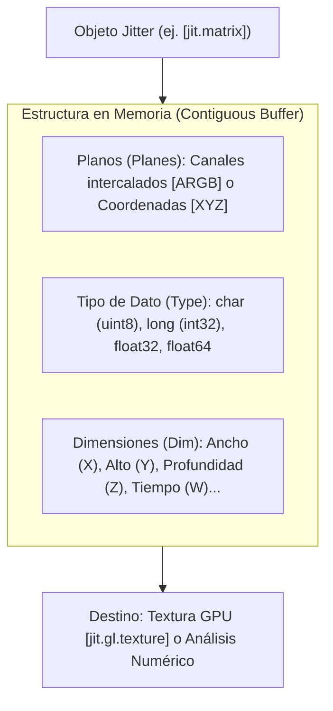

# Apéndice A: Computación Visual y Espacial: Jitter, Matrices y `jit.gen`

Mientras que MSP manipula flujos unidimensionales de audio a frecuencias de muestreo elevadas ($f_s = 48\text{ kHz}$), **Jitter** es la extensión de Max diseñada para el procesamiento multidimensional de datos a velocidades de cuadro (*framerate* de control o video, típicamente de 30 a 120 fps). 

Aunque popularmente se lo asocia con el procesamiento de video, arquitectónicamente Jitter es mucho más que eso: es un **motor genérico de álgebra lineal y matrices $N$-dimensionales** optimizado para gráficos 3D por hardware (OpenGL / Metal / DirectX), geometría computacional, sistemas de partículas y procesamiento de shaders compilados al vuelo mediante `jit.gen` y `jit.gl.slab`.

---

## 1. La Estructura Fundamental: Anatomía de una Matriz Jitter

Toda información en Jitter se representa mediante una matriz definida estrictamente por cuatro atributos inmutables en memoria:

$$\text{Matriz Jitter} = \langle \text{Planos}, \text{Tipo}, \text{Dimensiones} \rangle$$



### 1.1. Planos (*Planes*)
Un plano representa una capa paralela de datos para cada celda de la matriz:
- **1 Plano**: Señales monocromáticas, mapas de altura (*heightmaps*), tablas de probabilidades o valores escalares.
- **3 Planos**: Coordenadas espaciales 3D $(X, Y, Z)$ o color RGB.
- **4 Planos**: Video estándar con canal alfa $(A, R, G, B)$ o cuaterniones de rotación 3D $(W, X, Y, Z)$.

### 1.2. Tipos de Datos (*Types*)
- `char`: Entero sin signo de 8 bits ($0 \dots 255$). Es el estándar de video convencional (bajo consumo de memoria).
- `long`: Entero con signo de 32 bits ($ -2^{31} \dots 2^{31}-1 $).
- `float32`: Punto flotante de precisión simple (IEEE 754). Imprescindible para geometría 3D, cálculos físicos y shaders GLSL.
- `float64`: Precisión doble de 64 bits.

---

## 2. El Pipeline Gráfico Acelerado por GPU (`jit.gl`)

En las versiones modernas de Max, procesar matrices píxel por píxel en la CPU es una práctica obsoleta para gráficos complejos. El ecosistema **`jit.gl`** delega todo el cálculo gráfico a la GPU mediante texturas y buffers de vértices.

```
+-------------------------------------------------------------+
|                     Pipeline de GPU Jitter                  |
|                                                             |
|  [jit.world] (Contexto Maestro, Render Loop a 60 fps)       |
|       |                                                     |
|       +---> [jit.gl.gridshape] (Geometría: Esfera / Toro)   |
|       |          | (Vértices 3D)                            |
|       |          v                                          |
|       +---> [jit.gl.pix] / [jit.gen] (Fragment & Vertex DSP)|
|       |          | (Transformación matricial JIT en GPU)    |
|       |          v                                          |
|       +---> [jit.gl.node] (Sub-escena con cámara / luces)   |
+-------------------------------------------------------------+
```

### 2.1. El Rol Central de `jit.world`
El objeto `[jit.world nombre_contexto]` unifica la ventana de visualización, el contexto de renderizado de hardware y el reloj maestro (*render loop*):
- `@enable 1`: Activa el bucle de renderizado sincronizado con el refresco de pantalla (*V-Sync*).
- `@floating 1`: Ventana siempre flotante sobre el patcher.
- En su outlet emite un `bang` a cada frame para sincronizar animaciones y disparos de control.

---

## 3. Aceleración JIT a Nivel de Vértices y Píxeles: `jit.gen` y `jit.gl.pix`

De forma análoga a cómo `gen~` revoluciona el audio compilando C++ al vuelo, en el dominio visual disponemos de:
- **`jit.gen`**: Compila algoritmos matemáticos en C/C++ optimizados para CPU vectorial (usando SIMD/AVX2) para operar sobre matrices multidimensionales arbitrarias.
- **`jit.gl.pix`**: Compila código **GLSL (OpenGL Shading Language)** directamente a la GPU para ejecutarse en paralelo masivo sobre millones de fragmentos/píxeles por segundo.

### 3.1. Operadores Esenciales en `jit.gen`
- `norm`: Coordenadas normalizadas $(0.0 \dots 1.0)$ a lo largo de las dimensiones de la matriz.
- `snorm`: Coordenadas simétricas normalizadas $(-1.0 \dots +1.0)$, ideales para centrar esferas o deformar mallas tridimensionales.
- `cell`: Coordenadas enteras exactas de la celda procesada.
- `dim`: Dimensiones totales de la matriz.

---

## 4. Sonificación y Visualización Audiovisual Reactiva

Uno de los puntos más altos de Max es la interacción bidireccional entre sonido y visuales:
1. **Audio hacia Video**: Podemos capturar un bloque de audio de MSP mediante `[jit.catch~]` y transformarlo instantáneamente en una matriz Jitter de 1 dimensión para dibujar osciloscopios 3D o deformar mallas poligonales al ritmo del espectro de frecuencias.
2. **Video hacia Audio**: A través de `[jit.spill~]` o `[jit.peek~]`, los píxeles de una imagen o modelo generative pueden leerse como tablas de ondas (*wavetables*) o disparadores de síntesis granular.

---

## 5. Laboratorio Práctico: Visualizador Reactivo Deformado por Audio

En el archivo complementario `lab_apendice_a_jitter.maxpat` construimos un sistema completo:
- Una esfera geodésica generada mediante `jit.gl.gridshape`.
- El audio de un sintetizador FM pasa por `jit.catch~` para extraer la envolvente de señal.
- Un operador `jit.gen` / `jit.gl.pix` toma la señal de audio y deforma las normales de los vértices 3D en tiempo real.
- Sistema protegido contra caídas de FPS mediante desacoplamiento en el hilo de dibujo.
