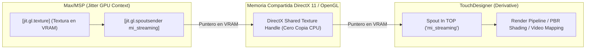

En la industria de las artes electrónicas, escenografía interactiva e instalaciones a gran escala, la arquitectura más potente consiste en dividir especialidades:
- **Max/MSP**: Como el cerebro central de computación de audio, sincronización rítmica, secuenciación determinista e interfaz con hardware analógico.
- **TouchDesigner (Derivative)**: Como el motor gráfico hiper-escalable de renderizado 3D en tiempo real, mapeo de proyección (*video projection mapping*), shaders complejos y control de pantallas LED masivas.

La comunicación entre ambos entornos debe ser robusta, determinista y de **latencia ultrabaja**. En este apéndice abordamos los dos protocolos estándares de la industria: **Spout (Windows) / Syphon (macOS)** para intercambio de video directo en memoria de video (VRAM), y **OSC (Open Sound Control)** sobre UDP para telemetría de control de alta velocidad.

---

## 1. El Puente de Texturas en GPU: Spout y Syphon

El mayor error de diseño para conectar Max con TouchDesigner es intentar transmitir frames de video por la red o por el bus PCIe entre CPU y GPU. La solución profesional es el **intercambio directo de texturas en VRAM (Zero-Copy GPU Sharing)**:



### 1.1. Ventajas de Spout / Syphon
1. **Zero-Copy Overhead**: Los píxeles jamás bajan a la memoria RAM del sistema operativo. Un frame 4K (3840x2160 a 60 fps) se comparte instantáneamente mediante un puntero compartido de DirectX/Metal sin consumir ancho de banda de la CPU.
2. **Latencia Sub-Frame**: Menor a 1 milisegundo entre el renderizado en Max y la recepción en TouchDesigner.

---

## 2. Telemetría de Control de Alta Velocidad: Open Sound Control (OSC)

Mientras que Spout mueve la imagen, **OSC** sobre paquetes UDP transmite el control gestual, disparos rítmicos y parámetros musicales:

```
+-------------------------------------------------------------+
|                Flujo de Control OSC (UDP)                   |
|                                                             |
|  [Max MSP: metro / envolventes]                             |
|       |                                                     |
|       v                                                     |
|  [pak /sintetizador/filtro 440. 0.8]                        |
|       |                                                     |
|       v                                                     |
|  [OpenSoundControl] / [udpsend 127.0.0.1 9000]              |
|       |                                                     |
|       +==================== (UDP Packet) ==================>|
|                                                             |
|  [TouchDesigner: OSC In CHOP (Port 9000)]                   |
|       |                                                     |
|       v                                                     |
|  [Transformación Geométrica / Disparo de Luces DMX]         |
+-------------------------------------------------------------+
```

### 2.1. Prácticas Profesionales de Enrutamiento OSC
- **Namespaces Jerárquicos**: Utilizá convenciones RESTful (`/audio/track1/volume`, `/audio/master/rms`, `/sensor/touch/state`).
- **Empaquetado (Bundles)**: En lugar de enviar 100 mensajes individuales por frame, agrupá los parámetros en un `OSC Bundle` para garantizar que todos los valores se actualicen en TouchDesigner en el mismo cuadro exacto (*atomic updates*).
- **Puertos UDP**: Puerto 9000 (Max a TD) y Puerto 9001 (TD a Max para retroalimentación).

---

## 3. Laboratorio Práctico: Puente Max a TouchDesigner

En el parche `lab_apendice_b_touchdesigner.maxpat`:
- Generamos un flujo de control OSC sincronizado con BPM de audio que transmite frecuencias dominantes y energía RMS.
- Preparamos el emisor `udpsend` configurado a `127.0.0.1:9000`.
- Documentamos la configuración paso a paso del operador `OSC In CHOP` en TouchDesigner.
