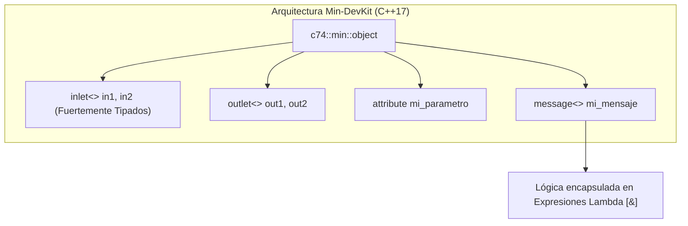

# Apéndice D: Desarrollo en C++ Moderno con Min-DevKit (C++17)

En el Módulo 6 exploramos la anatomía del C SDK tradicional (`ext.h`, `t_object`, tablas de despacho con punteros a funciones y macros de C). Aunque el SDK clásico es ultrarrápido y compatible con 30 años de código histórico, programar objetos complejos en C puro puede volverse verboso, propenso a fugas de memoria (*memory leaks*) y vulnerable a errores de casteo de punteros opacos (`void *`).

Para modernizar radicalmente el desarrollo de objetos externos, Cycling '74 creó **Min-DevKit**: un framework de desarrollo basado en **C++17 declarativo**, fuertemente tipado, que utiliza plantillas (*templates*), lambdas y el principio RAII (*Resource Acquisition Is Initialization*).

---

## 1. Filosofía Arquitectónica de Min-DevKit

Min-DevKit reemplaza la herencia de structs de C y las llamadas imperativas a `class_addmethod()` por una **declaración estática y declarativa de la interfaz del objeto**.



### 1.1. Comparativa: C SDK vs. Min-DevKit

| Aspecto | Max C SDK Clásico (C99) | Cycling '74 Min-DevKit (C++17) |
| :--- | :--- | :--- |
| **Punto de Entrada** | Función global `ext_main(void *r)` | Macro `MIN_EXTERNAL(mi_clase)` |
| **Gestión de Memoria** | `object_alloc()` / `sysmem_freeptr()` manual | Gestión RAII automática (`std::unique_ptr`, `std::vector`) |
| **Definición de Inlets** | Creación implícita o con `proxy_new()` | Miembros declarativos `inlet<> mi_inlet { this, "descripción" };` |
| **Despacho de Métodos** | Punteros a funciones C casteados a `(method)` | Mensajes vinculados con lambdas fuertemente tipadas |
| **Documentación** | Manual o comentarios externos | Auto-documentación integrada (`description`, `tags`) |

---

## 2. Anatomía de un Objeto Min-DevKit: `mi_objeto_min.cpp`

Fijate en la claridad, elegancia y seguridad de tipos que ofrece este código:

```cpp
#include "c74_min.h"

using namespace c74::min;

class escalador_min : public object<escalador_min> {
public:
    MIN_DESCRIPTION {"Escalador aritmético moderno en C++17 con Min-DevKit"};
    MIN_TAGS        {"utilities, math"};
    MIN_AUTHOR      {"Curso Max/MSP"};

    // 1. Declaración de Inlets (Entradas)
    inlet<>  in_val  { this, "(number) Valor numérico a procesar", "float" };
    inlet<>  in_mult { this, "(number) Factor multiplicador", "float" };

    // 2. Declaración de Outlets (Salidas)
    outlet<> out_resultado { this, "(number) Resultado escalado", "float" };

    // 3. Atributos con valores por defecto y límites
    attribute<number> factor { this, "factor", 2.0,
        description {"Factor de escala constante"}
    };

    // 4. Manejador de mensaje para punto flotante usando lambdas de C++
    message<type::float_number> float_msg { this, "float",
        "Multiplica la entrada por el factor actual",
        MIN_FUNCTION {
            number input = args[0];
            number result = input * factor;
            out_resultado.send(result);
            return {};
        }
    };
};

MIN_EXTERNAL(escalador_min);
```

---

## 3. Manejo de Señales de Audio en Min-DevKit (`sample_operator`)

Para objetos MSP de audio en tiempo real, Min-DevKit ofrece clases base especializadas como `sample_operator` o `vector_operator`:

```cpp
class distorsion_min : public object<distorsion_min>, public sample_operator<1, 1> {
public:
    MIN_DESCRIPTION {"Saturador suave muestra a muestra en Min-DevKit"};

    inlet<>  audio_in  { this, "(signal) Audio IN" };
    outlet<> audio_out { this, "(signal) Audio OUT", "signal" };

    attribute<number> drive { this, "drive", 1.0 };

    // Operador ejecutado muestra a muestra (Zero-overhead inline)
    samples<1> operator()(sample input) {
        sample driven = input * drive;
        sample saturated = std::tanh(driven);
        return { saturated };
    }
};
```

El compilador de C++ inlinea automáticamente el método `operator()`, generando código máquina idéntico o superior al bucle manual de audio en C, pero con toda la seguridad de tipos moderna.
