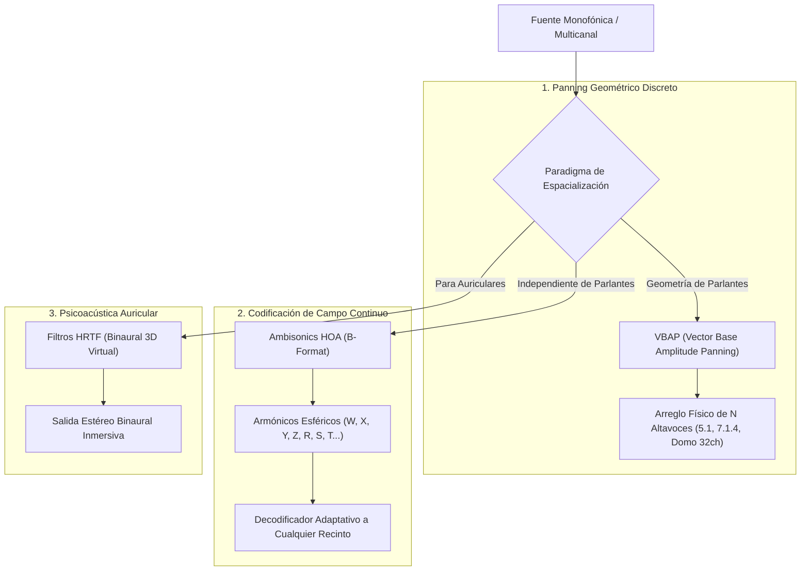

El sonido en el mundo físico no es un fenómeno estéreo ni una línea que sale de dos monitores de estudio: es un campo de presión acústica tridimensional continuo que interactúa con la geometría del espacio, los materiales y la fisionomía de nuestra cabeza y pabellón auditivo.

En la música electroacústica, los conciertos multicanal, el diseño sonoro de videojuegos y la realidad virtual, **Max/MSP es el estándar de facto a nivel mundial para el procesamiento y espacialización de audio 3D**. En este apéndice abordamos los dos paradigmas matemáticos y acústicos fundamentales: **IRCAM Spat5** y **Ambisonics de Orden Superior (HOA)**.

---

## 1. Los Paradigmas de Espacialización 3D

### 1.1. VBAP (Vector Base Amplitude Panning - Ville Pulkki)
- Divide el espacio tridimensional de parlantes en triángulos (o pares en 2D).
- Calcula la ganancia de cada altavoz como una combinación lineal de vectores de base en coordenadas cartesianas. Si la fuente virtual coincide con un parlante, solo ese parlante suena; si se mueve entre ellos, la energía se reparte preservando la potencia acústica total.

### 1.2. Ambisonics de Orden Superior (HOA - Gerzon / Daniel / Di Liscia)
- **Desacoplamiento Total**: En lugar de mezclar para un número fijo de parlantes, se codifica la direccionalidad de la onda en una serie de **armónicos esféricos** independientes de la disposición física de los altavoces.

#### Ecuaciones Canónicas de Codificación FuMa (Oscar Pablo Di Liscia / Mariano Cura)
En el tratado *Síntesis Espacial de Sonido (UNQ / CMMAS)*, Oscar Pablo Di Liscia y Mariano Martín Cura detallan la síntesis de señales formato B a partir de coordenadas espaciales normalizadas en una esfera unitaria: azimut $\theta$ (plano horizontal), elevación $\phi$ (plano vertical) y distancia $r$:

1. **Primer Orden (4 Canales: $W, X, Y, Z$):**
   $$\begin{aligned}
   W &= \frac{1}{\sqrt{2}} \cdot S \\
   X &= \cos(\theta) \cos(\phi) \cdot S \\
   Y &= \sin(\theta) \cos(\phi) \cdot S \\
   Z &= \sin(\phi) \cdot S
   \end{aligned}$$
   donde $W$ es el componente omnidireccional de presión de referencia y $X, Y, Z$ son los componentes dipolares ortogonales correspondientes a los ejes adelante/atrás, izquierda/derecha y arriba/abajo.

2. **Segundo Orden (9 Canales: suma de $R, S, T, U, V$):**
   Añade armónicos esféricos cuadrupolares para mayor selectividad direccional y resolución angular en recintos amplios:
   $$\begin{aligned}
   R &= \sin(2\phi) \cdot S \\
   S &= \cos(\theta) \sin(2\phi) \cdot S \\
   T &= \sin(\theta) \sin(2\phi) \cdot S \\
   U &= \cos(2\theta) \cos^2(\phi) \cdot S \\
   V &= \sin(2\theta) \cos^2(\phi) \cdot S
   \end{aligned}$$

#### Decodificación de Fase Corregida / Control de Opuestos (Gordon Monro / Malham)
La decodificación directa general recrea un frente de onda ideal en un punto central infinitesimal (*sweet spot*), pero genera altavoces que emiten señales en contrafase respecto a los opuestos. Como documenta Di Liscia, en una sala de conciertos esto degrada severamente la localización para los oyentes periféricos. 
Para resolverlo, se aplican **ponderaciones en fase (*in-phase decoding*)** donde la ganancia de cada altavoz $k$ ubicado en $(\theta_k, \phi_k)$ garantiza que todos los parlantes colaboren constructivamente sin cancelaciones destructivas:
$$P_k = \frac{1}{N} \left( W \sqrt{2} + \frac{2}{3}(X \cos \theta_k + Y \sin \theta_k) \right)$$

---

## 2. La Suite IRCAM Spat5: Acústica y Percepción

El paquete **Spat5** (desarrollado por el equipo de Representaciones Musicales del IRCAM) no solo posiciona el sonido en el espacio, sino que modela la **acústica perceptiva de recintos**:

1. **Sonido Directo (*Direct Sound*)**: Retardo temporal por distancia ($\Delta t = d / c$) y atenuación por ley del cuadrado inverso de la distancia ($1/d^2$).
2. **Reflexiones Tempranas (*Early Reflections*)**: Ecos discretos generados por las paredes que informan al cerebro sobre el tamaño aparente de la habitación.
3. **Reverberación Tardía (*Late Reverberation*)**: Redes de retardo con retroalimentación (FDN - *Feedback Delay Networks*) densas, homogéneas y libres de coloración tímbrica.
4. **Control Perceptivo**: En lugar de ajustar coeficientes biquad abstractos, Spat5 te permite automatizar atributos psicoacústicos: *Source Presence* (presencia de la fuente), *Warmth* (calidez acústica), *Envelopment* (envolvimiento del oyente) y *Room Size* (volumen del espacio).

---

## 3. Laboratorio Práctico: Panner Circular 3D con Simulación de Distancia y Headroom

En el parche interactivo `lab_apendice_f_audio_espacial.maxpat`:
- Implementamos una fuente sonora en órbita tridimensional circular continua.
- Calculamos el retardo temporal variable de propagación del aire con `delay~`.
- Modulamos la atenuación de alta frecuencia dependiente de la distancia del aire mediante un filtro pasa-bajos dinámico.
- Distribuimos la energía sonora a un sistema de 4 cuadrantes (cuadrafónico simulado) con atenuación de headroom nominal de -12 dB.
